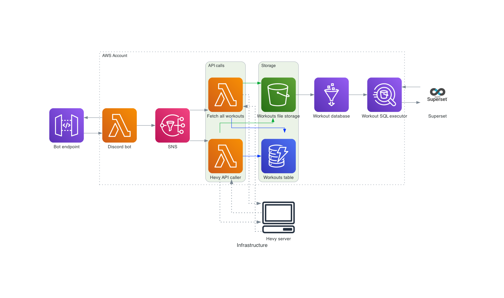

# Silka AWS Infrastructure

This repository contains the complete infrastructure-as-code and supporting scripts for the **Silka Workouts** platform, including:
- Discord bot integration
- Data ingestion from the Hevy API
- Data lake and analytics stack (Athena, Glue, S3, Superset)
- Automated deployment using Terraform, Terragrunt, Docker, and Packer

---

## Table of Contents

- [Silka AWS Infrastructure](#silka-aws-infrastructure)
  - [Table of Contents](#table-of-contents)
  - [Architecture Overview](#architecture-overview)
  - [Repository Structure](#repository-structure)
  - [Prerequisites](#prerequisites)
  - [Environment Setup](#environment-setup)
  - [Deployment](#deployment)
    - [1. Build and Push Lambda Docker Images](#1-build-and-push-lambda-docker-images)
    - [2. Terragrunt Environments](#2-terragrunt-environments)
  - [Local Development (Superset)](#local-development-superset)
  - [Modules Overview](#modules-overview)
  - [Security Notes](#security-notes)
  - [Troubleshooting](#troubleshooting)
  - [License](#license)
  - [Contact](#contact)

---

## Architecture Overview



The infrastructure is designed to ingest workout data from the Hevy API, store it in AWS (S3, DynamoDB), and make it queryable via Athena and Glue. A Discord bot provides an interface for users to interact with the system. Superset is used for analytics and visualization.

**Main AWS Components:**
- **API Gateway**: Exposes endpoints for the Discord bot.
- **Lambda Functions**: 
  - `discord_bot`: Handles Discord interactions.
  - `hevy_api_caller`: Fetches and processes workout data.
  - `fetch_all_workouts`: Bulk fetches all workouts from Hevy.
- **SNS**: Used for decoupling bot commands and data processing.
- **S3**: Stores raw and processed workout data.
- **DynamoDB**: Metadata and indexing for workouts.
- **Athena & Glue**: Query and catalog workout data.
- **Superset**: Analytics UI, deployed on EC2 or locally via Docker.

---

## Repository Structure

```
.
├── environments/           # Terragrunt environment configs (dev, prod)
├── modules/                # Terraform modules (lambdas, api_gateway, ecr, dynamodb, etc.)
│   ├── lambdas/            # Lambda Docker build, variables, and deployment
│   ├── superset-user/      # IAM user for Superset
│   ├── superset_instance/  # EC2 and Docker Compose for Superset
│   └── ...                 # Other infra modules
├── local_postgres/         # Local Docker Compose for Superset development
├── side-scripts/           # Utility scripts (bot commands, diagrams, etc.)
├── Makefile                # Build and deployment automation
└── README.md               # (You are here)
```

---

## Prerequisites

- **AWS Account** with sufficient permissions (IAM, Lambda, S3, DynamoDB, ECR, EC2, etc.)
- **AWS CLI** configured (`aws configure`)
- **Terraform** >= 1.6.1
- **Terragrunt** (for environment management)
- **Docker** and **Docker Compose**
- **Packer** (for building Lambda Docker images)
- **Python 3.11** (for local scripts and Superset)
- **uv** ([https://github.com/astral-sh/uv](https://github.com/astral-sh/uv)) for Python dependency management (compatible with Pipfile/Pipfile.lock)

---

## Environment Setup

1. **Clone the repository:**
    ```sh
    git clone https://github.com/your-org/silka.git
    cd silka
    ```

2. **Configure AWS credentials:**
    ```sh
    aws configure
    ```

3. **Install dependencies:**
    - **Terraform:** https://learn.hashicorp.com/tutorials/terraform/install-cli
    - **Terragrunt:** https://terragrunt.gruntwork.io/docs/getting-started/install/
    - **Docker & Docker Compose:** https://docs.docker.com/get-docker/
    - **Packer:** https://developer.hashicorp.com/packer/install
    - **Python:** https://www.python.org/downloads/
    - **uv:** Follow install instructions at https://github.com/astral-sh/uv (e.g. `curl -LsSf https://astral.sh/uv/install.sh | sh`)

4. **Set up environment variables:**
    - Copy `.env.example` to `.env` in relevant directories and fill in secrets (AWS keys, Discord tokens, etc.).
    - Example for `modules/.env`:
      ```
      DISCORD_APP_PUBLIC_KEY=...
      HEVY_TOKEN=...
      OTP_RANDOM_KEY=...
      DISCORD_WEBHOOK=...
      AWS_ACCESS_KEY_ID=...
      AWS_SECRET_ACCESS_KEY=...
      AWS_DEFAULT_REGION=eu-central-1
      ```

5. **Install Python dependencies with uv:**
    - To install all dependencies from the lock file:
      ```sh
      uv sync
      ```
    - To add a new package:
      ```sh
      uv add <package>
      ```
    - For more, see [uv documentation](https://github.com/astral-sh/uv).

---

## Deployment

### 1. Build and Push Lambda Docker Images

All Lambda functions are packaged as Docker images and pushed to AWS ECR using Packer.

- **Build and deploy all Lambda images and infrastructure:**
    ```sh
    make push-all
    ```
    This will:
    - Build all Lambda Docker images (`fetch_all_workouts`, `discord_bot`, `hevy_api_caller`)
    - Push them to ECR
    - Apply Terraform via Terragrunt for the selected stage (`dev` by default)

- **Deploy a single Lambda image:**
    ```sh
    make push-fetch-all-workouts
    make push-discord-bot
    make push-hevy-api-caller
    ```

- **Apply infrastructure only (no Docker builds):**
    ```sh
    make apply
    ```

- **Set up the LanceDB in the S3 Bucket**
    ```sh
    make init-lancedb
    ```

### 2. Terragrunt Environments

- **dev** and **prod** environments are managed in `environments/dev` and `environments/prod`.
- Each environment has its own `terragrunt.hcl` that points to the root modules and sets environment-specific variables.

---

## Local Development (Superset)

You can run Superset locally for development and analytics:

```sh
cd local_postgres
docker-compose up
```

- Access Superset at [http://localhost:8088](http://localhost:8088)
- Default credentials and DB connection are set via `.env` files.

---

## Modules Overview

- **lambdas/**: Lambda function deployment, ECR image lookup, SNS integration, and environment variables.
- **api_gateway.tf**: API Gateway setup for Discord bot endpoint.
- **dynamodb.tf**: DynamoDB table for workout metadata, with GSI for querying by workout day.
- **ecr.tf**: ECR repositories and lifecycle policies for Lambda images.
- **iam.tf**: IAM roles and policies for Lambda and Superset access.
- **athena/**: Athena database, Glue catalog, and S3 bucket for query results.
- **superset-user/**: IAM user and credentials for Superset to access Athena and S3.
- **superset_instance/**: EC2 and Docker Compose setup for running Superset in the cloud.

---

## Security Notes

- **Sensitive values** (tokens, secrets, keys) are loaded from `.env` files and not stored in the repository.
- **IAM policies** are scoped to only necessary resources (Athena, S3, Glue, DynamoDB).
- **SNS topic policy** is open for demonstration; restrict in production.
- **Superset IAM user credentials** are output as sensitive values.

---

## Troubleshooting

- **Docker image build errors:** Ensure Docker and Packer are installed and running.
- **Terraform/AWS errors:** Check AWS credentials and permissions.
- **Superset connection issues:** Verify `.env` values and that all containers are running.
- **Discord bot not responding:** Check Lambda logs in AWS Console and ensure API Gateway is deployed.

---

## License

MIT License. See [LICENSE](LICENSE) for details.

---

## Contact

For questions or contributions, please open an issue or contact the repository maintainer.